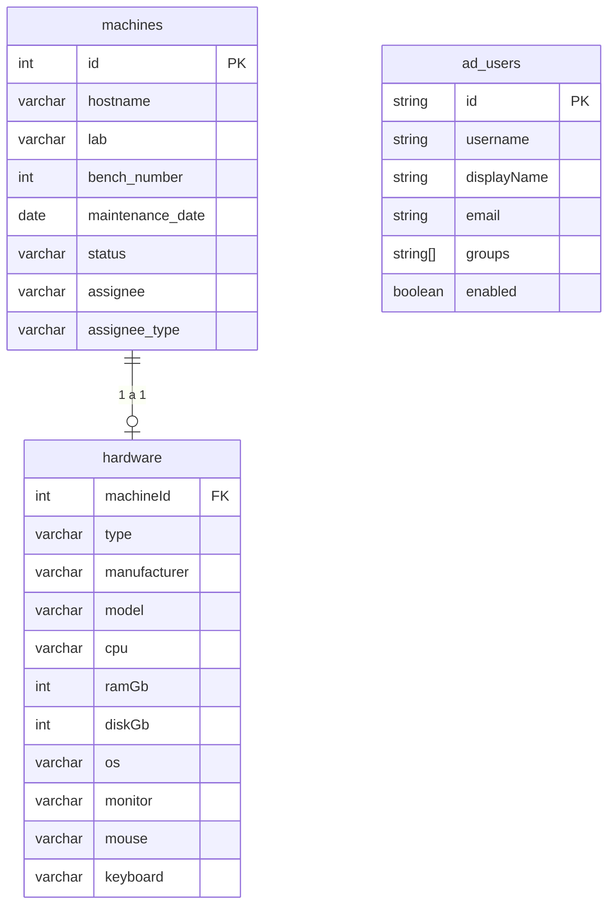
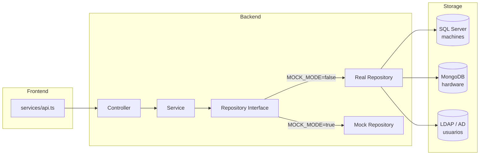

# Arquitectura de Datos



## Capa de repositorios (backend)

```
src/repositories/
├── interfaces/
│   ├── IMachineRepository.ts      ← CRUD de máquinas
│   ├── IHardwareRepository.ts     ← CRUD de hardware
│   └── IUserRepository.ts         ← CRUD de usuarios LDAP
│
├── sql/
│   └── machine.repository.ts      → SQL Server (tabla machines)
│
├── mongo/
│   └── hardware.repository.ts     → MongoDB (colección hardware)
│
└── ldap/
    └── user.repository.ts         → Active Directory / mock LDAP
```

Cada interfaz tiene **dos implementaciones**: una real (SQL / Mongo / LDAP) y una **mock** (en `src/mock/repositories/`). El switch se controla con `MOCK_MODE` en el `.env`.

## Almacenamiento por entidad

| Entidad | DB | Tabla / Colección | Repositorio real | Repositorio mock |
|---------|----|-------------------|------------------|------------------|
| Machine | SQL Server | `machines` | `repositories/sql/machine.repository.ts` | `mock/repositories/machine.repository.ts` |
| Hardware | MongoDB | `hardware` | `repositories/mongo/hardware.repository.ts` | `mock/repositories/hardware.repository.ts` |
| AD User | LDAP / AD | — (mock en memoria) | `repositories/ldap/user.repository.ts` | `mock/repositories/user.repository.ts` |

## Diagrama de flujo de datos



## SQL Server — `machines`

| Columna | Tipo | Descripción |
|---------|------|-------------|
| `id` | `INT IDENTITY` | Clave primaria |
| `hostname` | `VARCHAR(100)` | Nombre de red (ej. `lab101-pc01`) |
| `lab` | `VARCHAR(50)` | Laboratorio al que pertenece |
| `bench_number` | `INT` | Número de banco/mesa |
| `maintenance_date` | `DATE` | Fecha del último mantenimiento |
| `status` | `VARCHAR(20)` | `active`, `maintenance` o `retired` |
| `assignee` | `VARCHAR(100)` | Nombre del asignado (opcional) |
| `assignee_type` | `VARCHAR(20)` | `student`, `teacher` o `technician` |

## MongoDB — `hardware`

| Campo | Tipo | Descripción |
|-------|------|-------------|
| `machineId` | `number` | FK a `machines.id` |
| `type` | `string` | `desktop` o `laptop` |
| `manufacturer` | `string` | Fabricante |
| `model` | `string` | Modelo |
| `cpu` | `string` | Procesador |
| `ramGb` | `number` | RAM en GB |
| `diskGb` | `number` | Disco en GB |
| `os` | `string` | Sistema operativo |
| `monitor` | `string` | Monitor |
| `mouse` | `string` | Mouse |
| `keyboard` | `string` | Teclado |

## Relaciones

- **`machines` → `hardware`**: 1 a 1, vía `machineId`
- **`machines.assignee`**: texto libre (nombre del asignado), no hay FK a una tabla de usuarios — los usuarios viven en AD/LDAP
