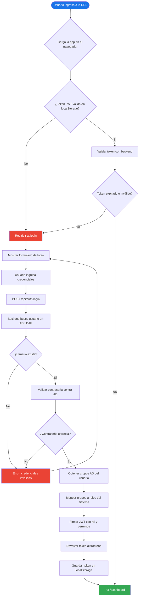
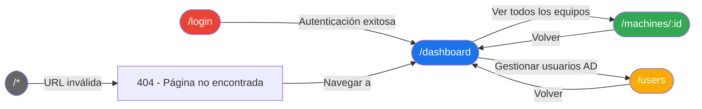
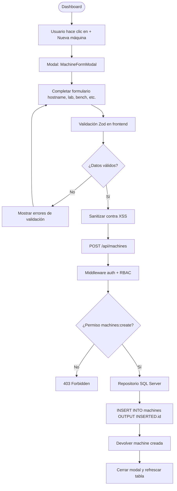
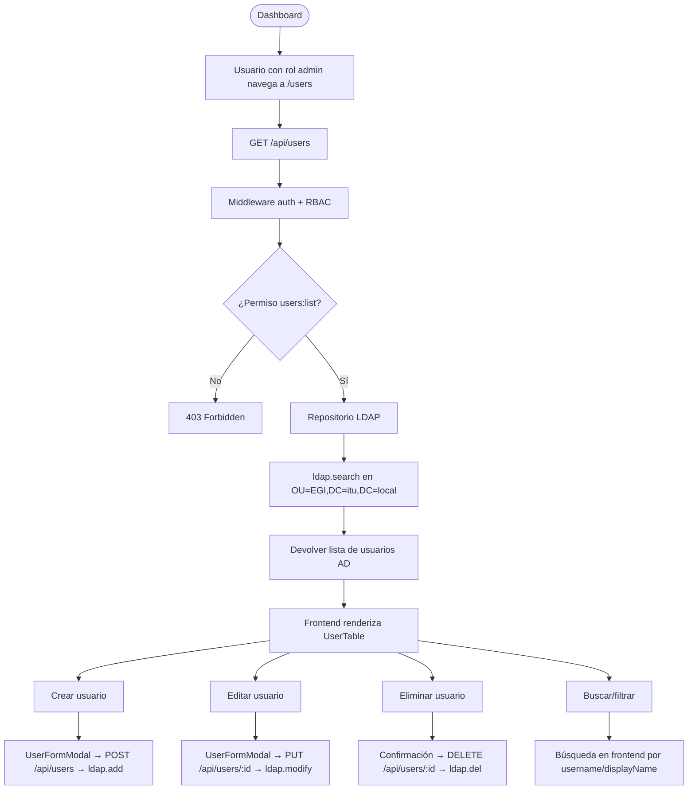
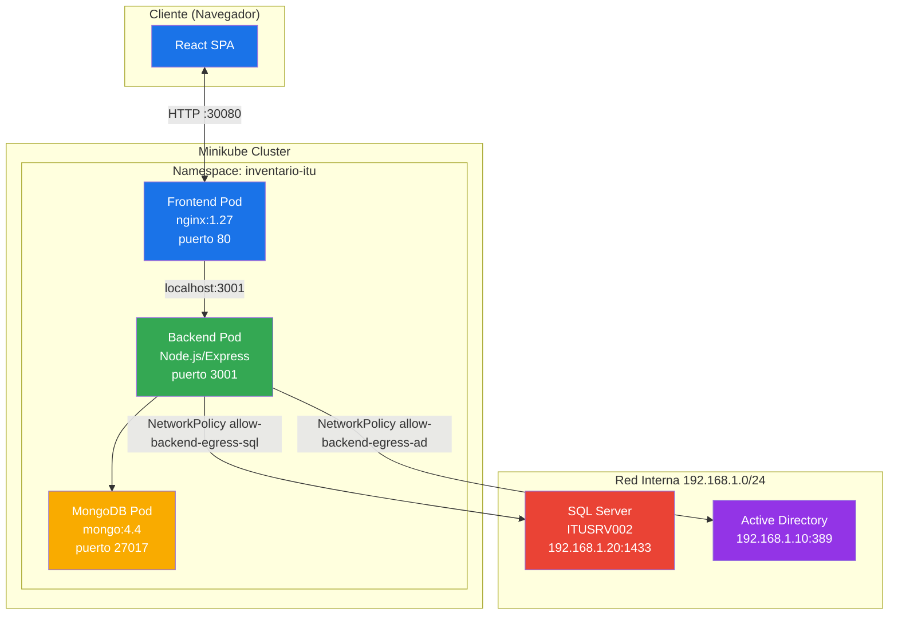

# Flujograma — Inventario ITU

> **Asignatura:** Proyecto Integrador
> **Sistema:** Inventario ITU — Gestión centralizada de activos informáticos
> **Tecnologías:** React 19 + Node.js/Express 5 + SQL Server + MongoDB + LDAP/AD + Kubernetes

---

## 1. Flujo de autenticación y control de acceso

---

## 2. Mapa de navegación principal

---

## 3. Flujo de gestión de inventario (Dashboard)

```mermaid
flowchart TD
    A([Dashboard principal]) --> B[Solicitar GET /api/machines]
    B --> C{Backend recibe request}
    C --> D[Middleware auth: validar JWT]
    D --> E{¿Token válido?}
    E -->|No| F[401 Unauthorized]
    E -->|Sí| G[Middleware RBAC: verificar permiso]
    G --> H{¿Rol tiene permiso machines:list?}
    H -->|No| I[403 Forbidden]
    H -->|Sí| J[Repositorio SQL Server]
    J --> K[SELECT * FROM machines ORDER BY lab, bench_number]
    K --> L[Mapear filas a objetos Machine]
    L --> M[Devolver JSON con lista de máquinas]
    M --> N[Frontend renderiza MachineTable]
    
    N --> O[Usuario hace clic en una máquina]
    O --> P[Navegar a /machines/:id]
    P --> Q[Solicitar GET /api/machines/:id]
    Q --> R[Repositorio SQL Server]
    R --> S[SELECT * FROM machines WHERE id = :id]
    S --> T{Máquina encontrada?}
    T -->|No| U[404 Not Found]
    T -->|Sí| V[Solicitar GET /api/hardware/:machineId]
    V --> W[Repositorio MongoDB]
    W -->     X[db.hardware.findOne &#40;machineId&#41;]
    X --> Y{¿Hardware existe?}
    Y -->|No| Z[Devolver machine sin hardware]
    Y -->|Sí| AA[Devolver machine + hardware]
    
    AA --> AB[Frontend renderiza MachineDetail]
    AB --> AC[LocationPanel: datos de SQL Server]
    AB --> AD[HardwarePanel: datos de MongoDB]

    style A fill:#1a73e8,color:#fff
    style I fill:#ea4335,color:#fff
    style F fill:#ea4335,color:#fff
    style U fill:#ea4335,color:#fff
```

---

## 4. Flujo de operaciones CRUD

### 4.1 Crear máquina

### 4.2 Editar hardware

```mermaid
flowchart TD
    A([MachineDetail]) --> B[Usuario hace clic en Editar hardware]
    B --> C[Modal: HardwareFormModal]
    C --> D[Cargar datos actuales desde MongoDB]
    D --> E[Modificar campos: CPU, RAM, Disco, SO, etc.]
    E --> F[Validación Zod en frontend]
    F --> G{¿Datos válidos?}
    G -->|No| H[Mostrar errores]
    H --> E
    G -->|Sí| I[Sanitizar contra XSS]
    I --> J[PUT /api/hardware/:machineId]
    J --> K[Middleware auth + RBAC]
    K --> L{¿Permiso hardware:update?}
    L -->|No| M[403 Forbidden]
    L -->|Sí| N[Repositorio MongoDB]
    N --> O[db.hardware.updateOne &#40;machineId, $set&#41;]
    O --> P{¿Documento existía?}
    P -->|No| Q[db.hardware.insertOne &#40;machineId, ...&#41;]
    P -->|Sí| R[Actualización confirmada]
    Q --> R
    R --> S[Devolver hardware actualizado]
    S --> T[Cerrar modal y refrescar panel]
```

### 4.3 Eliminar máquina

```mermaid
flowchart TD
    A([Dashboard]) --> B[Usuario hace clic en Eliminar]
    B --> C[Modal de confirmación]
    C --> D{¿Confirmar?}
    D -->|No| E[Cancelar]
    D -->|Sí| F[DELETE /api/machines/:id]
    F --> G[Middleware auth + RBAC]
    G --> H{¿Permiso machines:delete?}
    H -->|No| I[403 Forbidden]
    H -->|Sí| J[Transacción: 1. Eliminar hardware de MongoDB]
    J --> K[db.hardware.deleteOne &#40;machineId&#41;]
    K --> L[2. Eliminar machine de SQL Server]
    L --> M[DELETE FROM machines WHERE id = :id]
    M --> N{¿Ambas operaciones exitosas?}
    N -->|No| O[Rollback implícito y error 500]
    N -->|Sí| P[204 No Content]
    P --> Q[Refrescar tabla de máquinas]
```

---

## 5. Flujo de gestión de usuarios AD

---

## 6. Flujo de logout y expiración de sesión

```mermaid
flowchart TD
    A([Usuario activo]) --> B{Dos condiciones posibles}
    B -->|Usuario hace clic en Cerrar sesión| C[Limpiar token de localStorage]
    B -->|Token JWT expira| D[Backend devuelve 401]
    C --> E[Redirigir a /login]
    D --> F[Frontend intercepta 401]
    F --> G[Limpiar token de localStorage]
    G --> E
```

---

## 7. Diagrama de integración entre servicios

---

## Leyenda

| Símbolo | Significado |
|---------|-------------|
| `[Rectángulo]` | Proceso / acción |
| `{Rombo}` | Decisión / condición |
| `([Paralelogramo])` | Inicio / fin |
| `( )` | Conector / página |
| Línea continua | Flujo normal |
| Línea punteada | Flujo alternativo / error |

---

## Roles y permisos del sistema

| Rol | Grupos AD | Permisos |
|-----|-----------|----------|
| **sysadmin** | GRP_Sysadmin | CRUD completo en máquinas, hardware y usuarios |
| **manager** | GRP_Manager | CRUD en máquinas y hardware, solo lectura en usuarios |
| **technician** | GRP_Technician | Lectura y actualización de máquinas y hardware |
| **teacher** | GRP_Teacher | Solo lectura de inventario |
