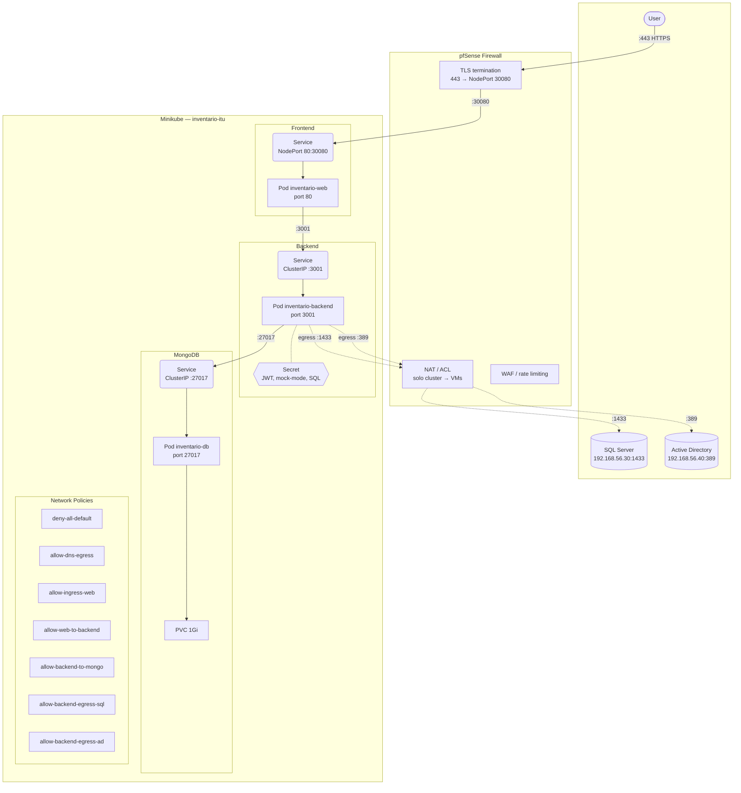

# Despliegue — Kubernetes (Minikube)

Backend, frontend y MongoDB corriendo en Minikube.

## Requisitos

- Minikube + Docker
- Node.js 20+

## Paso a paso

```bash
# 1. Iniciar Minikube (con Calico para network policies)
minikube start --cni=calico

# 2. Build imágenes en el daemon de Minikube
eval $(minikube docker-env)
docker build -t inventario-web:latest frontend/
docker build -t inventario-backend:latest backend/

# 3. Aplicar manifiestos
kubectl apply -f k8s/namespace/
kubectl apply -f k8s/mongo/
kubectl apply -f k8s/backend/
kubectl apply -f k8s/frontend/
kubectl apply -f k8s/network-policies/

# 4. Esperar a que los pods estén listos
kubectl rollout status deployment/inventario-db -n inventario-itu --timeout=120s
kubectl rollout status deployment/inventario-backend -n inventario-itu --timeout=120s
kubectl rollout status deployment/inventario-web -n inventario-itu --timeout=120s
```

O el script automatizado:

```bash
bash k8s/deploy-local.sh
```

## Verificación

```bash
kubectl get pods -n inventario-itu
# NAME                                  READY   STATUS    RESTARTS   AGE
# inventario-backend-7864fbff4f-q8gcw   1/1     Running   0          87s
# inventario-db-65798c85c5-7qbxb        1/1     Running   0          88s
# inventario-web-57f79d7756-4rbph       1/1     Running   0          87s

kubectl get svc -n inventario-itu
# NAME                 TYPE        CLUSTER-IP      EXTERNAL-IP   PORT(S)
# inventario-backend   ClusterIP   10.99.224.254   <none>        3001/TCP
# inventario-db        ClusterIP   10.96.96.246    <none>        27017/TCP
# inventario-web       NodePort    10.96.72.235    <none>        80:30080/TCP
```

## Persistencia

| Dato            | Backend                 | K8s                                 |
| --------------- | ----------------------- | ----------------------------------- |
| Máquinas        | SQL Server (`machines`) | Mock (sin SQL Server en el cluster) |
| Hardware        | MongoDB (`hardware`)    | Mock (`MOCK_MODE=true`)             |
| Usuarios / Auth | Mock (en memoria)       | Mock                                |

En el cluster, `MOCK_MODE=true` en el Secret, así que todo usa arreglos en memoria. Para activar modo real, editar `k8s/backend/secret.yaml`: descomentar `MOCK_MODE: "false"`, `MONGO_URI` y `MONGO_DB_NAME`, y apuntar SQL Server a una instancia accesible.

## Acceso desde la red local

Minikube con driver `docker` aísla el cluster en una red interna (`192.168.49.0/24`). El NodePort `30080` solo es accesible desde la máquina que ejecuta Minikube.

El script `deploy-local.sh` configura automáticamente una regla `iptables DNAT` en Linux para redirigir el tráfico desde la IP local de la máquina hacia el cluster:

```
Host (Linux):30080  ──DNAT──>  Minikube:30080  ──NodePort──>  Pod nginx:80
```

Esto simula el NAT que haría pfSense en producción.

| Plataforma | Acceso al frontend                     |
| ---------- | -------------------------------------- |
| Linux      | `http://<ip-del-server>:30080`         |
| macOS      | `kubectl port-forward -n inventario-itu svc/inventario-web 8080:80` |

Para eliminar las reglas iptables manualmente:

```bash
iptables -t nat -D PREROUTING -p tcp --dport 30080 \
  -j DNAT --to-destination $(minikube ip):30080
```

## Notas

- Las imágenes `inventario-web` e `inventario-backend` se construyen localmente en el daemon de Minikube (no están en ningún registry). `mongo:7` se pullea de Docker Hub.
- El backend arranca en **mock mode** (`MOCK_MODE=true` en el Secret) porque no hay SQL Server ni Active Directory dentro del cluster.
- El health check del backend está en `/health` (no `/api/health`).

## Arquitectura



## Servicios expuestos

| Servicio | Tipo      | Puerto interno | NodePort |
| -------- | --------- | -------------- | -------- |
| Frontend | NodePort  | `80`           | `30080`  |
| Backend  | ClusterIP | `3001`         | —        |
| MongoDB  | ClusterIP | `27017`        | —        |

## Detener

```bash
minikube delete
```
