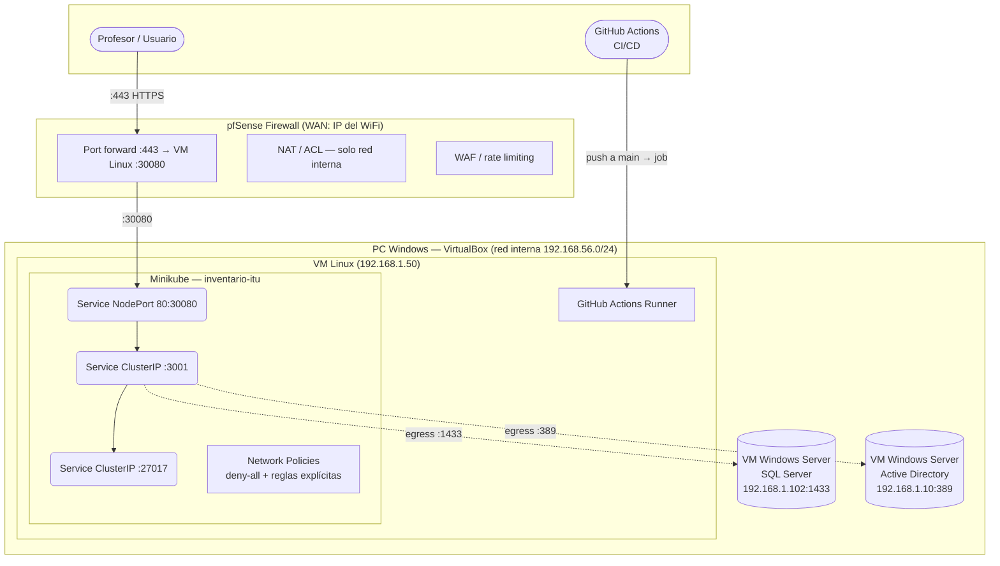

# Despliegue — Producción (VirtualBox + pfSense)

Arquitectura completa con Minikube, SQL Server, Active Directory y pfSense, todos corriendo como VMs en VirtualBox sobre una PC Windows.

## Arquitectura



## Requisitos

| Componente | Mínimo recomendado |
|---|---|
| PC Windows (host) | 16 GB RAM |
| VM pfSense | 256 MB RAM, 1 CPU |
| VM SQL Server | 3–4 GB RAM, 2 CPUs |
| VM AD | 2 GB RAM, 1 CPU |
| VM Linux (Minikube) | 3 GB RAM, 2 CPUs |

## Red VirtualBox

Todas las VMs están en la LAN de pfSense (`192.168.1.0/24`). pfSense tiene un adaptador WAN con IP en la red del aula.

| VM | IP | Rol |
|---|---|---|
| pfSense WAN | `<WAN_IP>` | Punto de entrada externo (red del aula, asignada por DHCP) |
| pfSense LAN | `192.168.1.254` | Gateway de la red interna |
| SQL Server | `192.168.1.102` | Base de datos relacional |
| Active Directory | `192.168.1.10` | Autenticación LDAP |
| Linux (Minikube) | `192.168.1.50` | Cluster K8s + GitHub Runner |

## Port forwards en pfSense

| Puerto WAN (WiFi) | Protocolo | Destino interno | Uso |
|---|---|---|---|
| `443` | TCP | `192.168.1.50:30080` | Frontend (acceso profesores) |

SQL Server y AD **no se exponen al exterior** — solo el backend dentro del cluster los alcanza vía red interna.

## Paso a paso — VM Linux

### 1. Instalar dependencias

```bash
# Docker
curl -fsSL https://get.docker.com | sh
sudo usermod -aG docker $USER

# kubectl
curl -LO "https://dl.k8s.io/release/$(curl -sL https://dl.k8s.io/release/stable.txt)/bin/linux/amd64/kubectl"
sudo install -o root -g root -m 0755 kubectl /usr/local/bin/kubectl

# Minikube
curl -LO https://storage.googleapis.com/minikube/releases/latest/minikube-linux-amd64
sudo install minikube-linux-amd64 /usr/local/bin/minikube

# Node.js 20
curl -fsSL https://deb.nodesource.com/setup_20.x | sudo -E bash -
sudo apt-get install -y nodejs
```

### 2. Iniciar Minikube

```bash
minikube start --cni=calico --memory=3072 --cpus=2
```

### 3. Configurar secret con modo real

Editar `k8s/backend/secret.yaml` — descomentar y completar:

```yaml
MOCK_MODE: "false"
JWT_SECRET: "<secreto-fuerte>"        # openssl rand -base64 32
SQL_SERVER: "192.168.1.102"
SQL_PORT: "1433"
SQL_USER: "sa"
SQL_PASSWORD: "<password-sql>"
SQL_DATABASE: "inventario_itu"
SQL_ENCRYPT: "false"
MONGO_URI: "mongodb://inventario-db:27017"
MONGO_DB_NAME: "inventario"
LDAP_URL: "ldap://192.168.1.10:389"
LDAP_BASE_DN: "DC=inventario,DC=itu"
LDAP_BIND_DN: "<bind-dn>"
LDAP_BIND_PASSWORD: "<bind-password>"
```

### 4. Bootstrap SQL Server (primera vez)

```bash
cd backend
npm ci
SQL_SERVER=192.168.1.102 SQL_USER=sa SQL_PASSWORD=<pass> node scripts/bootstrap.mjs
```

### 5. Desplegar

```bash
bash k8s/deploy-local.sh
```

### 6. Verificar

```bash
kubectl get pods -n inventario-itu
# Todos deben estar Running

# Health check
curl http://localhost:30080
# → frontend React

# Desde la red WiFi
curl http://192.168.56.10:30080
```

## Instalar el GitHub Actions Runner

En la VM Linux, ir a **GitHub → repo → Settings → Actions → Runners → New self-hosted runner** y seguir las instrucciones. Seleccionar Linux x64.

```bash
# Los comandos exactos los provee GitHub, ejemplo:
mkdir actions-runner && cd actions-runner
curl -o actions-runner-linux-x64.tar.gz -L https://github.com/actions/runner/releases/download/v2.x.x/actions-runner-linux-x64-2.x.x.tar.gz
tar xzf ./actions-runner-linux-x64.tar.gz
./config.sh --url https://github.com/<org>/<repo> --token <TOKEN>

# Instalar como servicio (arranca automático)
sudo ./svc.sh install
sudo ./svc.sh start
```

El runner queda con el label `self-hosted`, que es exactamente lo que usa `deploy.yml`.

## Secrets de GitHub

En **Settings → Secrets and variables → Actions** del repo:

| Secret | Valor |
|---|---|
| `SQL_SERVER` | `192.168.1.102` |
| `SQL_PORT` | `1433` |
| `SQL_USER` | `sa` |
| `SQL_PASSWORD` | password del SA |
| `SQL_DATABASE` | `inventario_itu` |
| `SQL_ENCRYPT` | `false` |
| `GITHUB_TOKEN` | automático, no crear |

## Persistencia

| Dato | Backend | Notas |
|---|---|---|
| Máquinas | SQL Server (`192.168.1.102`) | `MOCK_MODE=false` |
| Hardware | MongoDB (`inventario-db` ClusterIP) | Pod dentro del cluster |
| Usuarios / Auth | Active Directory (`192.168.1.10`) | LDAP sobre red interna |

## Flujo CI/CD completo

```
git push main
    │
    ├── ci.yml (runners GitHub)
    │   lint + typecheck + build
    │
    └── deploy.yml (runner self-hosted en VM Linux)
        bootstrap SQL → build imágenes → push GHCR
        → kubectl apply → rollout → smoke test
```

## Detener

```bash
minikube stop       # pausa el cluster, conserva datos
minikube delete     # elimina todo
```
