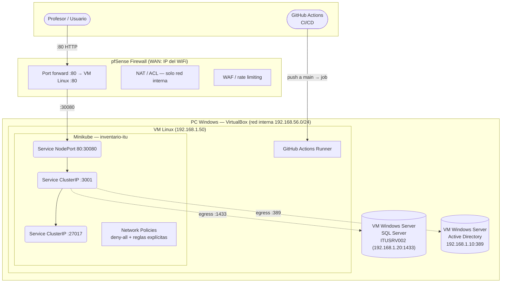

# Despliegue — Producción (VirtualBox + pfSense)

Arquitectura completa con Minikube, SQL Server, Active Directory y pfSense, todos corriendo como VMs en VirtualBox sobre una PC Windows.

## Arquitectura



## Requisitos

| Componente | Mínimo recomendado |
|---|---|
| PC Windows (host) | 16 GB RAM |
| VM pfSense | 256 MB RAM, 1 CPU |
| VM SQL Server | 3–4 GB RAM, 2 CPUs |
| VM AD | 2 GB RAM, 1 CPU |
| VM Linux (Minikube) | 3 GB RAM, 2 CPUs |

## Red VirtualBox

Todas las VMs están en la LAN de pfSense (`192.168.1.0/24`). pfSense tiene un adaptador WAN con IP en la red del aula.

| VM | IP | Rol |
|---|---|---|
| pfSense WAN | `<WAN_IP>` | Punto de entrada externo (red del aula, asignada por DHCP) |
| pfSense LAN | `192.168.1.254` | Gateway de la red interna |
| SQL Server | `ITUSRV002 (192.168.1.20)` | Base de datos relacional |
| Active Directory | `192.168.1.10` | Autenticación LDAP |
| Linux (Minikube) | `192.168.1.50` | Cluster K8s + GitHub Runner |

## Guías detalladas

| Tema | Documento |
|---|---|
| Setup VM Linux (Minikube, iptables, secrets, runner) | [vm-linux.md](vm-linux.md) |
| pfSense NAT y firewall | [pfsense-nat.md](pfsense-nat.md) |
| Pruebas de conectividad | [pruebas-conexion.md](pruebas-conexion.md) |
| Configuración SQL Server | [scripts/sql-server.md](scripts/sql-server.md) |
| Configuración Active Directory | [scripts/active-directory.md](scripts/active-directory.md) |
| Topología de red | [arquitectura/topologia.md](../arquitectura/topologia.md) |

## Persistencia

### Datos

| Dato | Backend | Notas |
|---|---|---|
| Máquinas | SQL Server (`ITUSRV002 / 192.168.1.20`) | `MOCK_MODE=false` |
| Hardware | MongoDB (`inventario-db` ClusterIP) | Pod dentro del cluster |
| Usuarios / Auth | Active Directory (`192.168.1.10`) | LDAP sobre red interna |

### Servicios del host

Los servicios de la VM Linux arrancan automáticamente al iniciar:

| Servicio | Rol | Depende de |
|---|---|---|
| `docker.service` | Motor de contenedores | — |
| `iptables-restore.service` | Restaura reglas DNAT desde `/etc/iptables/rules.v4` | — |
| `minikube.service` | Inicia el clúster Minikube con Calico | Docker + iptables-restore |

## Flujo CI/CD completo

```
git push main
    │
    ├── ci.yml (runners GitHub)
    │   lint + typecheck + build
    │
    └── deploy.yml (runner self-hosted en VM Linux)
        bootstrap SQL → build imágenes → push GHCR
        → kubectl apply → rollout → iptables (safety net) → smoke test
```

## Detener

```bash
minikube stop       # pausa el cluster, conserva datos
minikube delete     # elimina todo
```
