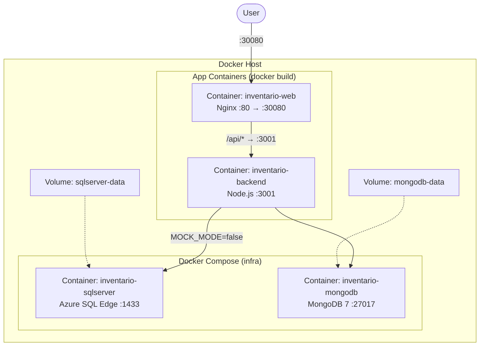

# Despliegue — Docker

Backend y frontend conectados a SQL Server y MongoDB reales via Docker Compose.

## Requisitos

- Docker
- Node.js 20+

## Paso a paso

O bien, todo containerizado:

```bash
# 1. Infra
docker compose up -d

# 2. Bootstrap (primera vez)
cd backend && node scripts/bootstrap.mjs && cd ..

# 3. Build imágenes
docker build -t inventario-backend:latest backend/
docker build -t inventario-web:latest frontend/

# 4. Backend container
docker run -d --name inventario-backend \
  --network egi_default \
  -e PORT=3001 \
  -e JWT_SECRET=dev-secret-change-me \
  -e MOCK_MODE=false \
  -e SQL_SERVER=inventario-sqlserver \
  -e SQL_PORT=1433 \
  -e SQL_USER=sa \
  -e SQL_PASSWORD=Mysql123 \
  -e SQL_DATABASE=inventario_itu \
  -e SQL_ENCRYPT=false \
  -e MONGO_URI=mongodb://inventario-mongodb:27017 \
  -e MONGO_DB_NAME=inventario \
  inventario-backend:latest

# 5. Frontend container
docker run -d --name inventario-web \
  --network egi_default \
  -p 30080:80 \
  inventario-web:latest

# 6. Verificar
curl http://localhost:3001/health
# → {"status":"ok","mockMode":false}
```

```bash
# 1. Levantar SQL Server + MongoDB
docker compose up -d

# 2. Bootstrap de tablas SQL Server (solo primera vez)
cd backend
node scripts/bootstrap.mjs

# 3. Backend
cd backend
npm run dev
# → http://localhost:3001 (mockMode: false)

# 4. Frontend
cd frontend
npm run dev
# → http://localhost:5173
```

## Arquitectura



## Variables de entorno

Crear `backend/.env`:

```env
PORT=3001
JWT_SECRET=dev-secret-change-me
MOCK_MODE=false
SQL_SERVER=localhost
SQL_PORT=1433
SQL_USER=sa
SQL_PASSWORD=Mysql123
SQL_DATABASE=inventario_itu
SQL_ENCRYPT=false
```

El frontend usa `VITE_USE_MOCK=false` en `.env.development`.

## Persistencia

| Dato | Backend | Notas |
|------|---------|-------|
| Máquinas | SQL Server (`machines`) | Siempre real con `MOCK_MODE=false` |
| Hardware | MongoDB (`hardware`) | Real via `mongoClient.ts` (wired en `server.ts`) |
| Usuarios / Auth | Mock (en memoria) | El cliente LDAP existe pero no está conectado |

El backend arranca en **mock mode** (`MOCK_MODE=true`) por defecto — todo usa arreglos en memoria. Con `MOCK_MODE=false` usa SQL Server y MongoDB reales.

## Verificación

```bash
curl http://localhost:3001/health
# → {"status":"ok","mockMode":false}
```

## Detener

```bash
# Si usás contenedores directos
docker rm -f inventario-web inventario-backend 2>/dev/null

# Baja la infra
docker compose down

# Si usás el modo dev
killall tsx vite 2>/dev/null
```
